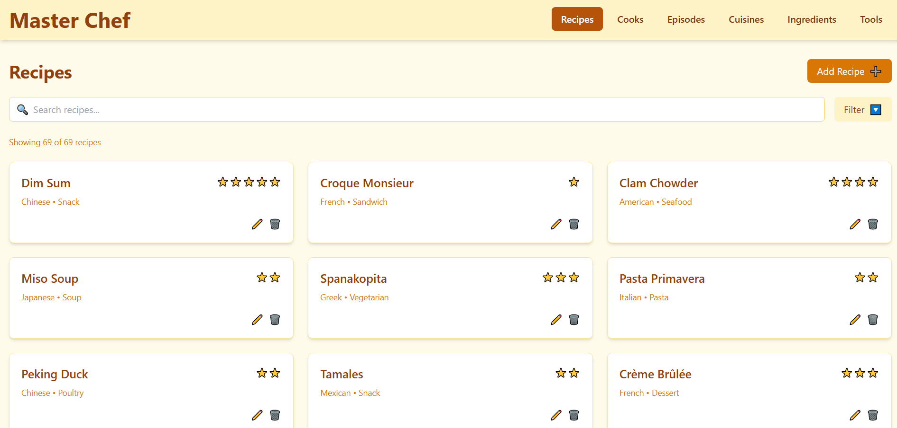
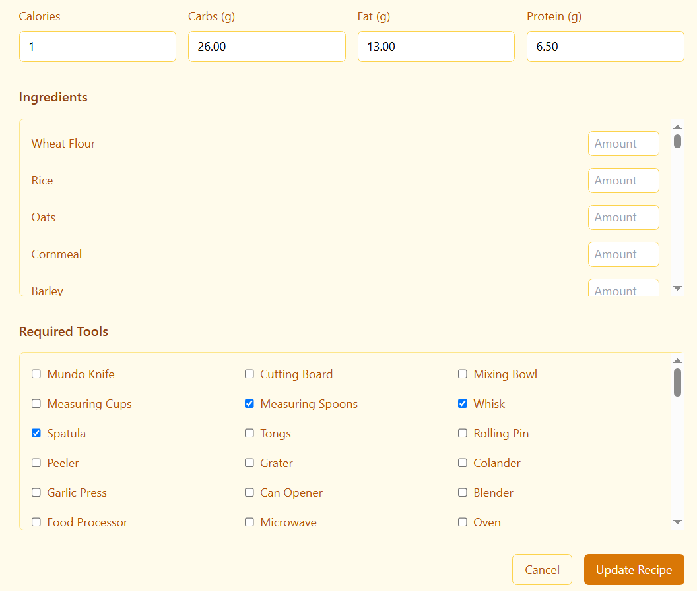

## Cooking-competition-DBMS

Management System for a cooking competition with **MariaDB**.

**Entity-Relationship Diagram:**

**Relational Diagram:**

**Installation Guide:**

- Clone this repository using `git clone https://github.com/Yassin1-prog/cooking-competition-DBMS.git`
- Have MariaDB server installed and connect to it with the following command `./mysql -u root -p`
- Create the database by running `source < path to db_schema.sql >`
- Fill the database with mock data through `source < path to insert_data.sql >`
- Make sure you have Python version 3.11.2 (at least) and establish connection to mysql via `pip install mysql-connector`
- To materialize the competition run `python < path to add_episodes.py >`
- Finally to handle User Authentication execute the following command `source < path to applicationUsers.sql >`

### Web App

A Restful api was created using **Express** as well as a UI with **React**. It implements crud operations on most of the entities
with the needed validation and sanitization. Filters and Search functionalities were also incorporated. **TailwindCSS** was used for styling.

> when running the web app use schema_v2.sql and insert_v2.sql

## 📸screenshots

  <!-- First image -->
  
  
  <!-- Second image -->
  
  
  <!-- Edit images in same row -->
  

    
    
  

  
  <!-- Remaining images vertical -->
  
  
  

